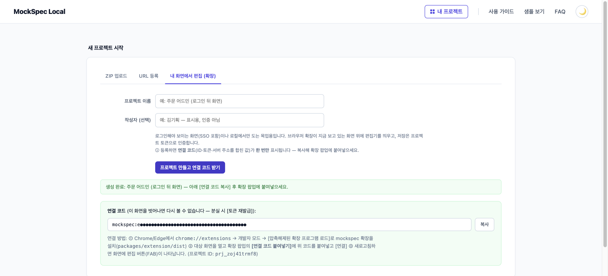
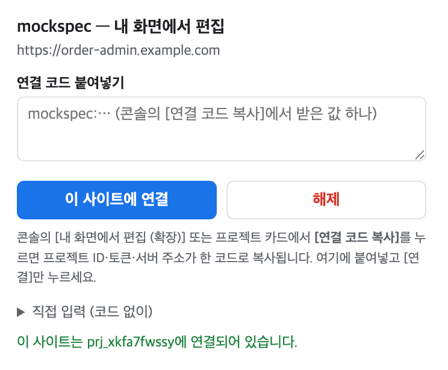
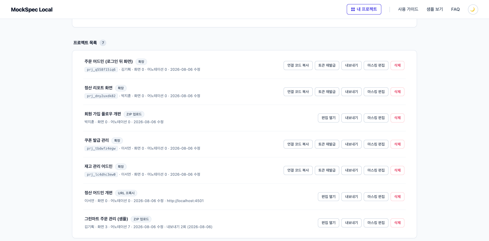
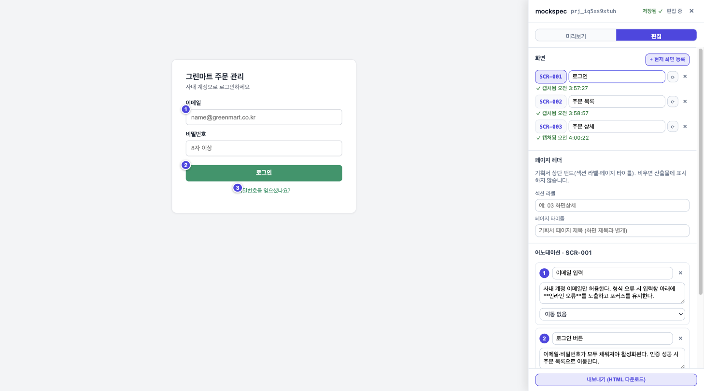
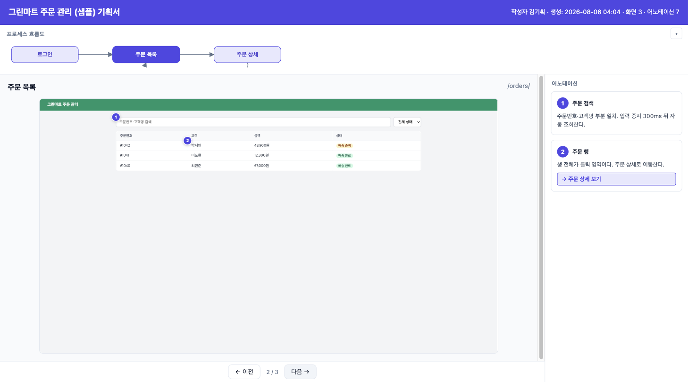

# Mockup-as-Spec (mockspec)

**이미 만든 목업에 숫자 어노테이션을 달아, 혼자서도 열리는 기획서 HTML로 바꿔 주는 사내 서비스.**
산출물은 파일 하나(`file://`)로 열리고, 열 때 네트워크 요청이 **0건**이다. 슬랙·메일로 던지면 받는 사람은 더블클릭만 하면 된다.

```
목업 등록  →  화면(상태) 등록 + 어노테이션  →  내보내기  →  단독 HTML 하나
```

- **의도는 사람이 입력한다** — 크롤링·LLM 추론이 아니라, 사람이 단 설명만 렌더한다
- **목업은 건드리지 않는다** — 편집 도구 주입은 서비스가 대신 한다
- **편집은 라이브, 산출물은 캡처** — 캡처는 사용자 브라우저에서 일어나고, 결과물은 서버 없이 재현된다

---

## ⚠️ 배포가 둘이다 — 목업 빌드 방법이 다르다

같은 제품의 두 배포가 **목업을 서빙하는 방식이 달라서, 목업 zip을 만드는 방법도 다르다.**
한쪽에서 되던 zip이 다른 쪽에서 안 열리는 일이 실제로 발생하므로 먼저 읽는다.

| | **사내판** (이 README의 기본) | **공개판** |
|---|---|---|
| 주소 | `http://localhost:4000` (로컬 실행) | **https://draftify-html.vercel.app** |
| 구현 | `packages/server` (Express, 파일 저장) | `apps/web` (Next.js, Supabase) |
| 목업 서빙 | 프로젝트별 **서브도메인 루트** (`{id}.localhost:4000/`) | **경로 접두** (`/m/{id}/`) |
| `<base>` 주입 | 없음 (루트라 불필요) | `<base href="/m/{id}/">` |
| **목업 빌드 base** | **절대(기본) 또는 상대** | **상대 필수** — `vite build --base=./` |
| 인증 | 없음 (사내망 전제) | Google OAuth · 이메일 매직링크 |
| 지원 경로 | A(zip) · B(프록시) · D(확장) | **A · D만** (B는 SSRF 표면 제거로 제외) |
| zip 한도 | 200MB | 50MB (해제 후 50MB·1500파일, 프로젝트 20개) |
| 사용 설명서 | [docs/user-guide.md](./docs/user-guide.md) | 서비스 내 `/guide` · `/faq` |

**공개판에 올릴 zip은 반드시 상대 경로로 빌드한다.** `/assets/app.js` 같은 절대 경로는
`/m/{id}/` 접두 밖을 가리켜 404가 나고, 화면이 빈 채로 열린다. HTML `<base>`는 상대 URL에만
적용되므로 서비스가 대신 고쳐 줄 수 없다. 빌드 후 `dist/index.html`에서 `src="./assets/…"`처럼
`./`로 시작하면 정상이다.

> 반대로 **상대 경로 빌드를 사내판에 쓸 때**는 주의한다. 사내판은 `<base>`를 주입하지 않아서,
> `/todo/1` 같은 깊은 URL로 직접 진입하거나 새로고침하면 자산 경로가 어긋난다. 두 배포를 함께
> 쓴다면 **공개판용 zip을 따로 빌드**하는 편이 안전하다.

---

## 요구 환경

- **Node.js 20+**
- 편집용 브라우저: **Chrome / Edge 최신** — `*.localhost` 서브도메인을 별도 설정 없이 로컬로 해석하기 때문
- (산출물 HTML 자체는 표준 API만 쓰므로 어떤 최신 브라우저에서도 열린다)

---

## 목업을 연결하는 세 가지 방법

목업을 어떻게 서비스에 붙이느냐에 따라 경로가 갈린다. **대부분은 A로 시작하면 된다.**
방식별 상세 사용법·동작 원리·제약은 **[사용 가이드](./docs/user-guide.md)**에 있다.

| 경로 | 이런 목업에 | 상세 |
|------|------------|------|
| **A. ZIP 업로드** | 빌드 결과물(zip)을 만들 수 있다 — **기본 권장** | 아래 [빠른 시작](#빠른-시작) + [가이드 §1](./docs/user-guide.md#1-경로-a--zip-업로드) |
| **B. URL 프록시** | 로그인 없이 URL만으로 열리는 목업 | [가이드 §2](./docs/user-guide.md#2-경로-b--url-프록시) |
| **D. 내 화면에서 편집** | 로그인해야 보이는 화면·사내망·로컬 (브라우저 확장) | 아래 [화면으로 보는 경로 D](#화면으로-보는-경로-d--내-화면에서-편집-확장) + [가이드 §3](./docs/user-guide.md#3-경로-d--내-화면에서-편집-확장--상세) |

이 README는 **경로 A(ZIP 업로드)의 빠른 시작**과 **경로 D의 화면 소개**를 다룬다.

> **경로 C는?** 설계상 C(레포 빌드)도 있다 — git URL을 받아 서버가 clone·build한 뒤 경로 A에 합류시키는 방식이다. 다만 S3 후순위라 아직 미구현이어서 여기서는 다루지 않는다 (PRD §4.2).

> 제품 정의·스펙은 [docs/README.md](./docs/README.md)(문서 인덱스), 에이전트 작업 규약은 [AGENTS.md](./AGENTS.md).

---

## 빠른 시작

### 1. 서버 실행

```bash
npm install                         # 최초 1회
npm run build                       # 최초 1회 또는 코드 변경 후
node packages/server/dist/index.js  # 기본 포트 4000
```

실행되면 두 종류의 URL이 뜬다:

```
[mockspec] 콘솔: http://localhost:4000  |  목업: http://{projectId}.localhost:4000
```

| URL | 무엇 | 직접 여는가 |
|-----|------|:---:|
| **콘솔** `localhost:4000` | 프로젝트 업로드·목록·내보내기·삭제 | ✅ 여기만 직접 연다 |
| **목업** `{projectId}.localhost:4000` | 업로드하면 서버가 편집 SDK를 주입해 **자동으로** 서빙 | 콘솔의 링크로 열림 |

> 프로젝트마다 호스트를 나누는 이유: 목업 간 localStorage·쿠키 격리와, 절대 경로(`/assets/…`) 빌드가 무수정으로 도는 것 (technical-spec §3.1).

설정은 환경 변수로만 준다 (오리진 하드코딩 금지 원칙):

| env | 기본값 | 용도 |
|-----|--------|------|
| `PORT` | `4000` | 리스닝 포트 |
| `MOCKSPEC_DATA_DIR` | 저장소 안 `data/` | spec·목업·스냅샷 저장 위치 (gitignore) |

서버가 꺼져 있는 동안의 편집은 브라우저 localStorage 큐에 쌓였다가 재기동 후 자동 반영된다. 초기화하려면 서버를 멈추고 `data/`를 지운다.

### 2. 목업 zip 준비

올리는 것은 **소스 코드가 아니라 빌드 산출물**이다. 목업 프로젝트에서:

```bash
npm run build           # dist/ 또는 build/ 생성
zip -r mockup.zip dist  # Finder에서 dist 우클릭 → "압축"도 동일
```

zip 루트가 `dist/` 한 겹으로 감싸져 있으면 서버가 자동으로 벗겨 해제한다.

| 조건 | 내용 |
|------|------|
| **필수** | 빌드 루트에 `index.html` (SSR 전용 앱은 정적 export 필요 — Next.js는 `output: 'export'`) |
| **크기** | zip 파일 기준 200MB 이하. `node_modules/`·`.git/`·`*.map`은 해제 시 자동 제외되지만, 크기 한도는 압축 파일 기준이니 빌드 결과물만 압축하길 권장 |
| **base** | 사내판은 루트·상대 둘 다 동작. **공개판에 올릴 zip은 상대 필수** — `vite build --base=./` (위 배포 비교표 참조) |

> 연습용 샘플이 필요하면 `npm run fixtures:zip` → `fixtures/todo-app.zip`(의존성 0 Todo SPA).

### 3. 업로드 → 편집

1. **http://localhost:4000** 접속 → 새 프로젝트 폼에 이름 + zip 업로드
2. 완료 안내의 **편집 열기 →** 링크 클릭 (목업이 새 탭에서 SDK 주입된 채 열림)

편집 화면 = 우하단 FAB → 우측 360px 패널:

| 하려는 것 | 방법 |
|-----------|------|
| **화면 등록** | 목업을 원하는 상태로 조작(라우팅·모달·필터…) → **[+ 현재 화면 등록]** → `✓ 캡처됨` 배지 확인 (SPA 주소가 바뀌면 **"새 화면으로 등록할까요?"** 배너로도 등록 가능) |
| **어노테이션 부착** | **편집 모드** 토글(Alt+Shift+E) → 설명할 요소 클릭 → 마커 생성 후 title·설명 입력 |
| **목업 조작으로 복귀** | **미리보기 모드**로 전환 (편집 모드에선 목업 클릭이 차단됨) |
| **저장** | 자동 (패널 상단 `저장됨 ✓`. 저장 버튼 없음) |

여기서 "화면"은 URL 단위가 아니라 **사람이 의미를 부여한 상태**(모달 열림, 탭 선택 등)다.
설명할 상태마다 "화면 등록 → 어노테이션 부착"을 반복한다. 어노테이션은 항상 현재 선택된 화면에 속한다.

### 4. 내보내기 → 산출물 확인

1. 콘솔 목록에서 **내보내기** → 단일 HTML 다운로드 (스냅샷 없는 화면이 있으면 확인 후 진행)
2. 다운로드한 HTML을 더블클릭(`file://`)으로 연다. 아래가 되면 정상:
   - 화면 전환이 되고, 각 화면이 편집 때 모습과 동일
   - 마커가 요소 위치에 붙고, 마커 ↔ 목록이 서로 하이라이트
   - DevTools Network 탭에 문서 자체 1건 외 외부 요청 0건
3. 이 파일 하나를 슬랙·메일로 전달 → 받은 사람은 그냥 열기만 하면 된다

---

## 화면으로 보는 경로 D — 내 화면에서 편집 (확장)

로그인해야 보이는 화면(SSO 포함)·사내망·로컬 개발 서버 위에서 **지금 보고 있는 화면 그대로** 기획서를 만드는 경로다.
설치·연결·트러블슈팅 상세는 [가이드 §3](./docs/user-guide.md#3-경로-d--내-화면에서-편집-확장--상세).

### 1. 프로젝트 등록 및 연결 코드 발급

콘솔의 **[내 화면에서 편집 (확장)]** 탭에서 프로젝트를 만들면 **연결 코드**(프로젝트 ID·토큰·서버 주소를 합친 값)가 발급된다. **이 화면을 벗어나면 다시 볼 수 없으니** 바로 복사한다 (분실 시 [토큰 재발급]).



### 2. 확장에 코드 등록 → 사이트 연결

기획서로 만들 화면이 열린 탭에서 확장 팝업을 열고, 복사한 연결 코드를 붙여넣어 **[이 사이트에 연결]**. 연결되면 하단에 연결된 프로젝트 ID가 표시된다.



### 3. 콘솔 프로젝트 목록

등록한 프로젝트는 콘솔 첫 화면의 **프로젝트 목록**에서 관리한다 — 등록 방식 배지, 화면·어노테이션 수, 내보내기 이력이 한 줄로 보인다. 확장 프로젝트는 **발급받은 브라우저 세션에서는** [연결 코드 복사]로 코드를 다시 받을 수 있고, 세션이 바뀌어 코드를 잃었다면 **[토큰 재발급]**으로 새 코드를 받는다.



### 4. 목업 편집

연결된 사이트 위에 편집 패널이 뜬다 — 보던 화면 그대로 **[+ 현재 화면 등록]**(캡처)하고, 편집 모드에서 요소를 클릭해 어노테이션을 단다. 화면 이동(예: 조회 → 검색 결과)도 지정할 수 있다. 저장은 자동.



### 5. 산출물 예시

**[내보내기 (HTML 다운로드)]** 결과물 — 프로세스 흐름도, 화면 네비, 마커가 정렬된 캡처 스냅샷, 어노테이션 패널이 담긴 **단독 HTML 하나**다. `file://`로 열리고 네트워크 요청 0건.



---

## 테스트

```bash
npm test           # vitest (unit + API)
npm run test:e2e   # Playwright — 빌드·fixtures zip·서버 기동까지 자체 수행
                   # 최초 1회: npx playwright install chromium
npm run test:e2e:web  # 공개판 DoD — 실 Supabase에 붙는다(apps/web/.env.local 없으면 스킵)
```

---

## 공개판 배포 (Vercel + Supabase)

**https://draftify-html.vercel.app** — `open-service` 브랜치가 프로덕션이다.
아래는 대시보드에서 한 번 설정하는 값이며, **기본값으로 두면 빌드가 실패한다.**

### Vercel 프로젝트 설정

| 항목 | 값 | 기본값으로 두면 |
|------|-----|----------------|
| Production Branch<br>(`Settings → Environments → Production → Branch Tracking`) | `open-service` | `main`에는 `apps/web`이 없어 배포 대상이 없다 |
| Root Directory | `apps/web` | 임포트 시 `packages/sdk`가 잡힌다 |
| **Framework Preset** | **Next.js** | `Other`로 잡히면 `No Output Directory named "dist"`로 실패. **Output Directory에 `.next`를 수동 지정하지 말 것** — 정적 취급이 되어 API 라우트·미들웨어가 죽는다 |
| **Install Command** (Override) | **`cd ../.. && npm install`** | Root Directory에서만 install 해 루트 `node_modules`가 없다 → `tsc: command not found` |
| Build Command | 비워 둔다 | `apps/web`의 `vercel-build`가 자동 실행된다(루트 선행 빌드 → `next build`) |

`vercel-build`가 필요한 이유: `apps/web`은 `packages/viewer/dist/main.js`와 `packages/sdk/dist/sdk.js`를
`?raw`로 인라인하는데, 이 산출물은 다른 워크스페이스가 만든다(technical-spec §8).

### 환경변수 (Production)

| 키 | 비고 |
|----|------|
| `NEXT_PUBLIC_SUPABASE_URL` | 공개 |
| `NEXT_PUBLIC_SUPABASE_PUBLISHABLE_KEY` | 공개 |
| `SUPABASE_SECRET_KEY` | **서버 전용 — `NEXT_PUBLIC_` 접두를 붙이면 브라우저 번들에 실려 RLS가 무력화된다** |

### Supabase (`Authentication → URL Configuration`)

- **Site URL**: `https://draftify-html.vercel.app`
- **Redirect URLs**: 프로덕션·로컬 각각 `/auth/callback`과 `/auth/confirm` — 총 4개.
  `/auth/confirm`은 매직링크를 **다른 기기에서 열 때** 쓰는 경로라 빠지면 그 케이스만 조용히 실패한다.
- Google OAuth는 Supabase가 중개하므로 **Google Cloud 쪽에 배포 도메인을 추가할 필요는 없다**
  (`https://<ref>.supabase.co/auth/v1/callback` 하나면 된다).

### 도메인이 바뀌면

`packages/extension/manifest.json`의 `host_permissions`를 **교체**한다(추가 아님, 와일드카드 금지 —
[packages/extension/README.md](./packages/extension/README.md) 절차).

---

## 저장소 구조

모노레포(npm workspaces). 모든 패키지가 **`shared`의 타입 계약을 공유**하고, 데이터는 목업 → server → 산출 HTML로 흐른다.

```
mockspec/
├─ packages/
│  ├─ shared      타입 계약 — 나머지 패키지가 공유하는 유일 소스
│  ├─ server      Express 5 — 업로드·서빙·SDK 주입·Spec API·export 조립
│  ├─ sdk         편집기 — Preact + Shadow DOM, 단일 IIFE 번들 sdk.js
│  ├─ viewer      뷰어 — 산출물 HTML에 인라인되는 vanilla TS
│  └─ extension   경로 D 브라우저 확장 — 로그인된 내 화면에 편집기를 직접 주입
│
├─ fixtures/todo-app   E2E·연습용 샘플 SPA (npm run fixtures:zip)
├─ e2e/                Playwright E2E (S1·S2·경로 D DoD)
├─ docs/               제품·기술 스펙 6종 (docs/README.md에서 시작)
└─ guide/              스펙의 근거가 된 원 결정 문서
```

의존 방향: `shared` → { `server`, `sdk`, `viewer`, `extension` }.
경로별로 쓰이는 패키지 — **A·B**는 `server`가 `sdk`를 주입하고, **D**는 `extension`이 `sdk`를 주입한다. 산출물에는 `viewer`가 인라인된다.

> 각 문서의 역할과 읽는 순서는 [docs/README.md](./docs/README.md), 작업 규약은 [AGENTS.md](./AGENTS.md).
